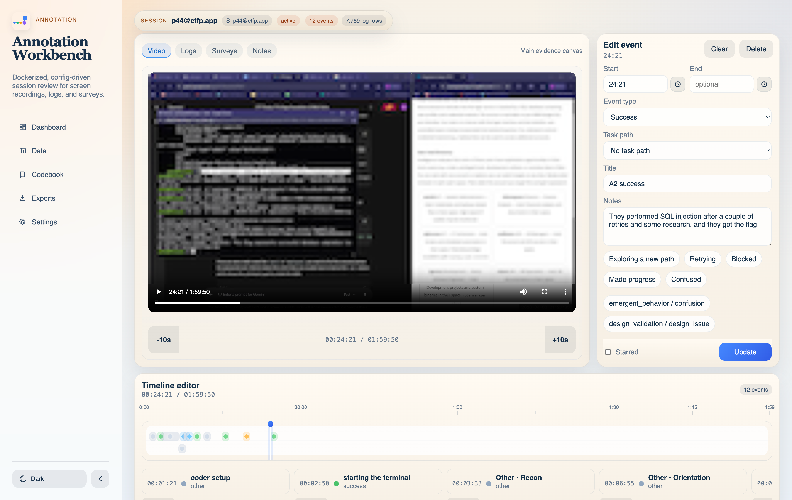

# Annotation Workbench

<p align="center">
  
</p>

Dockerized, local-first session review and annotation app for screen recordings, logs, surveys, timelines, memos, and optional AI-assisted review.



## Requirements

- Docker
- Docker Compose

## Run The Public Sample

```bash
docker compose up --build
```

This starts the essential app services, `backend` and `frontend`, against the tracked sample project in `project/`.

## Run Your Private Local Study

To run the app against your real local study data instead of the sample project:

```bash
PROJECT_DIR=project.local docker compose up --build
```

- Frontend: `http://localhost:5173`
- Backend API: `http://localhost:8000/api`
- JupyterLab: `http://localhost:8888/lab`

## Embedded Notebooks

The Docker Compose stack includes a local-only JupyterLab service for exploratory processing notebooks.
Open the app and use the `Notebooks` page to launch the embedded notebook workspace.

- JupyterLab is optional and is behind the `notebooks` Compose profile. Start it with `docker compose --profile notebooks up -d notebooks`.
- JupyterLab is bound to `127.0.0.1` by default and is not exposed on public interfaces.
- The frontend and backend Compose ports are also bound to `127.0.0.1` for local development.
- The default token is `annotation-local-token`; override it with `JUPYTER_TOKEN=...`.
- The notebook server mounts the repo at `/workspace` and opens the active project folder, so it can read and write project `config/`, `data/`, assets, notebooks, and processed outputs.
- The Notebooks page can switch JupyterLab between the bundled light and dark themes, or match the app theme.
- If you do not start the profile, the UI will show the command to start JupyterLab later.
- If port 8888 is already in use, set `JUPYTER_PORT=8890` and restart Docker Compose.

## AI Assistant

Annotation Workbench includes an optional AI Assistant for first-pass review support. It can:

- draft editable session memo text directly into the memo field
- answer session-aware questions in a floating assistant panel
- summarize session evidence and suggest review directions
- use minute-style timecodes such as `03:46` instead of raw seconds
- keep every AI output reviewable before it is saved to project data

AI is disabled until you configure a provider from the app’s `Settings` page. Supported provider types:

- OpenAI
- Anthropic Claude
- Ollama
- OpenAI-compatible APIs

Provider settings are stored in the ignored local file `.annotation-workbench.ai.local.json`, so API keys and private endpoints are not committed. You can also configure AI through environment variables:

- `ANNOTATION_AI_ENABLED`
- `ANNOTATION_AI_PROVIDER`
- `ANNOTATION_AI_MODEL`
- `ANNOTATION_AI_BASE_URL`
- `ANNOTATION_AI_API_KEY`
- `ANNOTATION_AI_TEMPERATURE`
- `ANNOTATION_AI_MAX_OUTPUT_TOKENS`

Remote providers may receive selected session context when you use AI actions. Use Ollama or another local endpoint if your study requires all model processing to stay on the local machine.

## Project layout

- `frontend/`: React + Vite UI
- `backend/`: FastAPI API and CSV-backed services
- `project/`: tracked sample project for the public repo
- `project.local/`: your real local study project data and config
- `docs/`: static GitHub Pages landing site for public documentation and project overview

## Built With

- [Docker](https://www.docker.com/) and Docker Compose for portable local setup
- [FastAPI](https://fastapi.tiangolo.com/) for the backend API
- [Pydantic](https://docs.pydantic.dev/) for request/response validation
- [PyYAML](https://pyyaml.org/) for project configuration files
- [React](https://react.dev/) for the frontend UI
- [Vite](https://vite.dev/) for frontend development and builds
- [TypeScript](https://www.typescriptlang.org/) for typed frontend code
- [TanStack Query](https://tanstack.com/query/latest) for frontend data fetching and cache invalidation
- [React Router](https://reactrouter.com/) for app routing
- [AG Grid Community](https://www.ag-grid.com/react-data-grid/) for the Data page spreadsheet viewer
- [assistant-ui](https://www.assistant-ui.com/) for the in-app assistant chat surface
- [LiteLLM](https://www.litellm.ai/) for provider-normalized AI model calls
- CSV files and the local filesystem as the transparent project data layer

## Study-specific files

The real files in `project.local/` are intended to stay local for each study.

- tracked in Git: the sample `project/` plus reusable config templates
- ignored locally: `project.local/`

The public repo includes a generic sample `project/` that is safe to publish. Your real study data
can stay in `project.local/`, and Docker can target it with `PROJECT_DIR=project.local`.

When both folders are present, you can also switch between them from the app’s `Settings` page.

## Public Docs

- landing/docs site source: `docs/`
- GitHub Pages URL: `https://kl1d.github.io/annotation/`

## Current status

This is the first publishable AI-assisted workbench stage:
- Dockerized frontend/backend
- Config-driven project loading
- Folder-based ingest for videos, survey CSVs, and participant log folders
- Session dashboard and review workspace
- Timeline event CRUD
- Tags, memo, logs, surveys, and CSV export routes
- Tabbed settings for project, AI, and config files
- Optional provider-configured AI Assistant
- Floating session-aware AI chat
- Embedded memo drafting into the memo textarea
- Local-only AI provider config file ignored by Git
- Static landing page in `docs/` with AI Assistant positioning

## Notes For Open-source Use

- the repo ships with a safe sample project in `project/`
- your real study files should stay in `project.local/`
- the sample project can be replaced with your own config and assets without changing app code
- AI keys and provider settings should stay in `.annotation-workbench.ai.local.json` or environment variables
